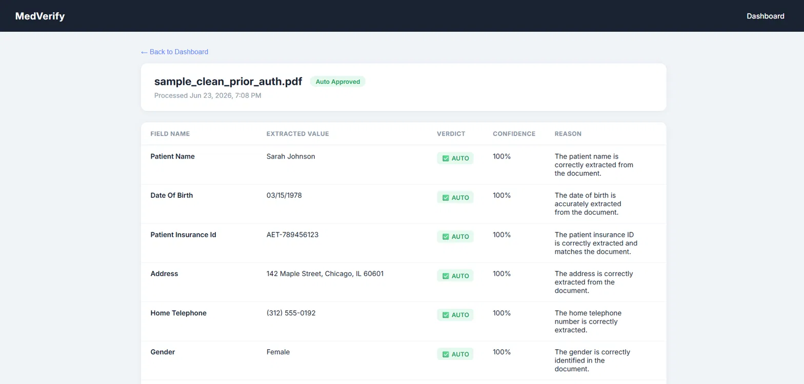
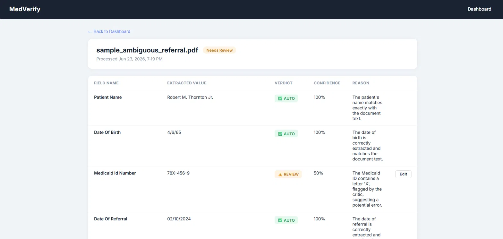
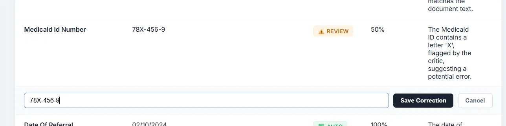

# MedVerify

Reducing human QC review in medical document processing using a three-agent LLM pipeline.

Update medverify/README.md

Replace the current "The Problem" section with this expanded version 
that covers the full narrative:

## The Problem

Medical document processing pipelines typically use a single LLM call 
to extract structured data from unstructured documents. This creates 
two compounding problems:

**LLMs make confident mistakes.** A single extraction call returns 
values with no signal about which outputs to trust. A misread NPI, 
a wrong dosage, a truncated member ID — all come back formatted 
correctly with nothing to distinguish them from accurate extractions.

**Without a quality signal, every document needs a human.** Companies 
compensate by putting a human reviewer on every extraction. The human 
is the only quality control in the system. This doesn't scale with 
document volume.

## How MedVerify Solves It

Three agents cross-examine each document independently:

- The **Extractor** pulls out every field it finds — no hardcoded schema, 
  works across prior auths, EOBs, clinical notes, and referral faxes.
- The **Critic** reads the same document without ever seeing the 
  extractor's output. This enforces zero anchoring bias — it forms 
  its own independent opinion of what's ambiguous, misread, or missing.
- The **Resolver** receives all three inputs and assigns every field 
  a verdict: AUTO, REVIEW, or REJECT — with a confidence score and 
  a one sentence reason.

The system generates its own quality signal per field. Humans only 
review what the pipeline is genuinely uncertain about — not every document.

**The goal is to push the auto-approval rate toward 100% gradually.** 
As flagged fields get corrected, patterns emerge — which document types 
cause problems, which fields are consistently uncertain. That data 
drives prompt improvements that reduce flags over time, shrinking 
the human workload toward zero.

## How It Works

Each document runs through three independent agent calls:

1. **Extractor** — reads the raw document text and extracts every field it can find into structured JSON. There is no hardcoded schema; the field list is discovered per document, so the same pipeline handles a prior auth form and a clinical note without separate logic.
2. **Critic** — reads the same raw document text independently, without ever seeing the extractor's output. This is enforced at the prompt level to eliminate anchoring bias: the critic forms its own opinion of what's ambiguous, misread, or missing before any extraction is shown to it.
3. **Resolver** — receives the original document, the extractor's output, and the critic's flags. For every field it assigns a verdict (`AUTO`, `REVIEW`, or `REJECT`), a confidence score, and a one-sentence reason.

A document is auto-approved only when **every** field verdict is `AUTO`. Otherwise it goes to a human review queue that shows only the flagged fields — not the whole document.

## Screenshots

| | |
|---|---|
|  | Clean prior auth — all fields AUTO approved |
|  | Ambiguous referral — Medicaid ID flagged for review |
|  | Inline correction UI for flagged fields |

## Tech Stack

| Layer | Technology |
|---|---|
| Frontend | React 18 |
| Backend | Python 3.13, Flask |
| Database | MySQL 8 |
| AI | GPT-4o (three independent agent calls per document) |
| Deployment | AWS Elastic Beanstalk (backend), S3 (frontend), RDS (database) |

## Live Demo

http://medverify-frontend.s3-website-us-east-1.amazonaws.com

## Local Setup

### Prerequisites

- Python 3.13
- Node.js 18+
- MySQL 8.0
- An OpenAI API key with GPT-4o access

### Backend

```bash
cd backend
python -m venv venv
venv\Scripts\activate          # Windows
# source venv/bin/activate     # macOS/Linux

pip install -r requirements.txt
```

Create `backend/.env`:

```
OPENAI_API_KEY=sk-...
DB_HOST=localhost
DB_USER=root
DB_PASSWORD=your_password
DB_NAME=medverify
UPLOAD_FOLDER=uploads
```

Create the database and tables:

```sql
CREATE DATABASE medverify;

CREATE TABLE documents (
  id INT AUTO_INCREMENT PRIMARY KEY,
  filename VARCHAR(255) NOT NULL,
  raw_text LONGTEXT,
  status ENUM('processing','auto_approved','needs_review','rejected') DEFAULT 'processing',
  created_at TIMESTAMP DEFAULT CURRENT_TIMESTAMP
);

CREATE TABLE extractions (
  id INT AUTO_INCREMENT PRIMARY KEY,
  document_id INT NOT NULL,
  field_name VARCHAR(255) NOT NULL,
  extracted_value TEXT,
  verdict ENUM('AUTO','REVIEW','REJECT'),
  confidence_score FLOAT,
  reason TEXT,
  FOREIGN KEY (document_id) REFERENCES documents(id)
);

CREATE TABLE pipeline_runs (
  id INT AUTO_INCREMENT PRIMARY KEY,
  document_id INT NOT NULL,
  extractor_output LONGTEXT,
  critic_output LONGTEXT,
  resolver_output LONGTEXT,
  total_tokens INT,
  duration_seconds FLOAT,
  created_at TIMESTAMP DEFAULT CURRENT_TIMESTAMP,
  FOREIGN KEY (document_id) REFERENCES documents(id)
);

CREATE TABLE corrections (
  id INT AUTO_INCREMENT PRIMARY KEY,
  extraction_id INT NOT NULL,
  original_value TEXT,
  corrected_value TEXT,
  created_at TIMESTAMP DEFAULT CURRENT_TIMESTAMP,
  FOREIGN KEY (extraction_id) REFERENCES extractions(id)
);
```

Run the API:

```bash
python app.py
```

The backend listens on `http://localhost:5000`.

### Frontend

```bash
cd frontend
npm install
```

`frontend/src/api.js` points at the deployed production backend by default. For local development, change `BASE_URL` to `http://localhost:5000`.

```bash
npm start
```

The app runs on `http://localhost:3000`.

## Key Design Decisions

- **Critic never sees extractor output.** Enforced at the prompt level, not just by convention — this is what makes the critic's review independent rather than a rubber stamp.
- **Dynamic field discovery.** The extractor has no fixed schema, so the same pipeline works across prior auths, EOBs, clinical notes, and referral faxes without per-document-type code.
- **Auto-approval requires all fields to be AUTO.** A single ambiguous field is enough to route the document to human review.
- **Every pipeline run is logged in full.** Extractor, critic, and resolver outputs, token usage, and duration are all persisted per run for audit and cost tracking.
- **Human corrections are stored separately** from the original extraction, preserving both values for future few-shot prompt improvement.
